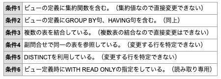

# Day 5

## 交差結合
実務においてクロス結合が役に立つケースは多くはない。各テーブルに存在する行動詞のすべての組み合わせを得ることができる。

以下の例は、`fruits`テーブルと、`kansou`テーブルをクロス結合する例。

```
SELECT * FROM fruits CROSS JOIN kansou;
```

## 内部結合
テーブルを結合するキーとなる列名を指定することで、共通の値をもつ行動詞を連結する。以下の例では、t1とt2を内部結合している例である。内部結合はクロス結合の結果から`ON`句で指定された結合条件を満たさない行は削除される。

t1

|id|hiragana|
|---|---|
|1|あ|
|2|い|
|3|う|

t2

|id|eng|
|---|---|
|2|ka|
|3|ki|
|4|ku|


```
SLECT * FROM table t1 INNER JOIN table t2 ON t1.id = t2.id
```

結果

|id|hiragana|id|eng|
|---|---|---|---|
|2|い|2|ka|
|3|う|3|ki|

## 外部結合
内部結合では、`ON`句で指定した条件に当てはまらなかった行は表示されなかったが、外部結合ではどちらかのテーブルに存在しているならば、そのテーブルの情報が欠けることなく出力される。

t1

|id|hiragana|
|---|---|
|1|あ|
|2|い|
|3|う|

t2

|id|eng|
|---|---|
|2|ka|
|3|ki|
|4|ku|

以下のクエリによって、左外部結合を行うと、

```
SLECT * FROM table t1 LEFT OUTER JOIN table t2 ON t1.id = t2.id
```

結果

|id|hiragana|id|eng|
|---|---|---|---|
|1|あ|||
|2|い|2|ka|
|3|う|3|ki|

以下のクエリによって、右外部結合を行うと、

```
SLECT * FROM table t1 RIGHT OUTER JOIN table t2 ON t1.id = t2.id
```

結果

|id|hiragana|id|eng|
|---|---|---|---|
|2|い|2|ka|
|3|う|3|ki|
|||4|ku|

以下のクエリによって、完全外部結合を行うと、

```
SLECT * FROM table t1 FULL OUTER JOIN table t2 ON t1.id = t2.id
```

|id|hiragana|id|eng|
|---|---|---|---|
|1|あ|||
|2|い|2|ka|
|3|う|3|ki|
|||4|ku|

## ビューの作成
ビューテーブルは、仮想テーブルであり、ユーザー毎に実行可能な処理をきめたり、ユーザーがみやすいようにテーブルを加工して見せることが可能である。また、ビューの実体はSQL文であり、テーブルのように大きな容量を必要としない。また、変更が比較的容易である。

order table

|id|order_by|
|---|---|
|120|yamada|
|119|tanaka|

detail table

|id|number|merchandise|
|---|---|---|
|120|1|egg|
|120|2|bread|
|119|3|rice|

```
CREATE VIEW yamada_order_merchandise
  AS SELECT * FROM order, detail
    WHERE order.id = detail.id
    AND order.order_by = 'yamada'
    WITH CHECK OPTION
```

上のクエリを実行すると以下のような結果になる。

yamada_order_merchandise

|id|order_by|number|merchandise|
|---|---|---|---|
|120|yamada|1|egg|
|120|yamada|2|bread|

以下のクエリを実行するとビューの削除ができる

```
DROP VIEW yamada_order_merchandise
```

ビューからデータを追加・更新・削除する場合、あたかもテーブルのデータを操作するように記述することが可能であるが、条件によっては追加・更新・削除ができない場合がある。



## 集合演算子
### UNION
和集合を表したいときに使う。

```
SELECT * FROM num_table where num in (1,2,3)
UNION
SELECT * FROM num_table where num in (3,4,5)
```

上のクエリを実行すると

結果

```
{1,2,3,4 5}
```

### UNION ALL
A, B に含まれる要素すべてが結果になる。重複要素も全件出る。

```
SELECT * FROM num_table where num in (1,2,3)
UNION ALL
SELECT * FROM num_table where num in (3,4,5)
```

## 限定述語
### ALL演算子
サブクエリによって取り出されたすべての値と比較を行う。

以下の例では、すべての英語の点数より高い数学の点数を表示している

```
SELECT * FROM tbl_exam
  WHERE math >= ALL(
    SELECT eng FROM tbl_exam
  );
```

結果

|id|eng|math|memo|
|---|---|---|---|
|120|0|95|nothing really matters|

### EXISTS演算子
サブクエリに取り出されたデータが一つでもあれば、メインクエリを実行し、なければ無効にする。

以下の例では、英語で70点以上のものがいれば。全生徒のデータを取得する。

```
SELECT * FROM tbl_std
  WHERE EXISTS (
    SELECT eng FROM tbl_exam
      WHERE eng > 70
  );
```

結果

|id|entrance|name|eng_name|addr1|addr2|
|---|---|---|---|---|---|
|0001|2020-04-01|砂糖|Taro Sato|hokkaido|1-9-3|
|0002|2018-08-01|潮|San Shio|shinjuku|2-9-2|
|0003|2002-01-01|徐|Ko Jo|akita|9-3-2|


### ANY演算子
サブクエリによって取り出された値のいずれかと比較する。

以下の例では、試験を受けているものの生徒一覧データを取得する

```
SELECT * FROM tbl_std WHERE id=ANY(SELECT id FROM tbl_exam);
```

結果

|id|entrance|name|eng_name|addr1|addr2|
|---|---|---|---|---|---|
|0001|2020-04-01|砂糖|Taro Sato|hokkaido|1-9-3|
|0002|2018-08-01|潮|San Shio|shinjuku|2-9-2|

## インデックス
インデックス（索引）とは、テーブルに格納されているデータに素早くたどり着くための仕組み。本の索引のようなものだと理解すると良い。テーブルを作成する際に、カラムに対して必要に応じて定義する。カラムに対して、インデックスを作成することを「インデックスを張る」とも言ったりする。

## トランザクション
データベースに対して行われる1つ以上の更新処理のこと。トランザクションによってデータ更新処理の確定や取り消しが 管理できる。

以下の例では、2角更新処理をトランザクションで処理している。開始文は`START TRANSACTION`で、処理を確定させるために`COMMIT`を最後に宣言している。

```
START TRANSACTION;

UPDATE SAMPLE_TABLE
SET NAME = 'ABC'
WHERE ID = 1;

UPDATE SAMPLE_TABLE
SET NAME = 'EFG'
WHERE ID = 2;

COMMIT
```

## COMMIT
トランザクションを確定させる処理。一度COMMITした結果は 元に戻すことができないので注意が必要。

## ROLLBACK
ROLLBACKはトランザクションを取り消す処理。ROLLBACKした場合、データベースはトランザクション開始前の状態に戻る。

<!--
TODO
## ロックの仕組み
## デッドロック
## プリペアドステートメント
[MySQL prepared statement document](https://dev.mysql.com/doc/refman/5.7/en/sql-prepared-statements.html)
-->

## 動的SQL
実行するたびにSQLを解析して実行形式に変換するため、処理効率が悪い。実行時にSQLの文字列を組み立てるため、探索条件を変更する時の自由度が高い。

以下の例は動的SQLの例である。

```
DECLARE @birthYear int = 1970
DECLARE @statement int = NVARCHAR(4000)

WHILE @birthYear <= 1971
BEGIN
  SET @stamenet = '
    SELECT JobTitle, Count(BusinessEntityID)
    FROM HumanResource.Employee
    WHERE Year(BirthDate) = ' + '
    CAST(@birthYear AS NVARCHAR) +
    'GROUP BY JobTitle'
  '

  EXECUTE sp_executesql @statement
  SET @birthYear = @birthYear + 1
END
```

`sp_executesql @statement`は、変数に保存されているSQLトランザクションを実行する。`sp_executesql`は`system stored procedure`の一つである。以下のようにすれば、実行できる。

```
  EXECUTE sp_executesql @statement
```

`EXECUTE` or `EXEC`コマンドは動的SQLを実行する。

```
EXECUTE @statement
```

<!--
TODO
## EXECUTE vs sp_executesql
## ストアドプロシージャ
イメージ的には関数。一連の操作をまとめておけて、動的に値を外部から与えて実行結果を変更することが可能
-->

## トリガー
特定のテーブルに対する(挿入・更新・削除)をトリガーに、予め、定義された処理を自動的に実行する機能のこと。実行タイミングとしては、指定された操作が実行される直前、または直後。

以下がトリガーの例。顧客ごとの累計売上高をテーブルと保持することが目的。orderテーブルに新たなレコードの挿入がなされたときに、aggregate_tableにも保存するという処理が行われている。

```
DELIMITER $$

CREATE
  TRIGGER aggregate_by_customer
  AFTER INSERT
  ON orders
  FROM EACH ROW
  BEGIN
    INSERT INTO
      aggregate_table (customer_id, total_amount)
    (SELECT customer_id, SUM(total)
      FROM orders
      GROUP BY customer_id)
    ON DUPLICATE KEY UPDATE
      customer_id = NEW.customer_id
      , total_amount = (SELECT SUM(total)
                          FROM orders
                          WHERE customer_id = NEW.customer_id
                          GROUP BY customer_id);
    END $$

    DELIMITER;
```

実際にトリガーを動かすと、

```
insert into
  orders(order_id, customer_id, total)
values
  ('7', 'USR002', 222)
```

このクエリを実行すると、aggregate_tableの値が勝手に更新される。

## 拡張SQL
レコードの抽出や追加、更新などだけではなく、複合文を使って、他の言語のように変数や条件文などを記述する方法。

## 結果セットとカーソル

## データベースドライバ


## 予約語

[予約語一覧](https://qiita.com/okazy/items/9dd6552fc678077e27cd)

## 参考・引用
- [Build Dynamic SQL in a Stored Procedure](https://www.essentialsql.com/build-dynamic-sql-stored-procedure/)

- [3分でわかるトリガー - 使い所と問題点を考える -](https://qiita.com/wanko5296/items/fa3620c48196acbd3ab6)
